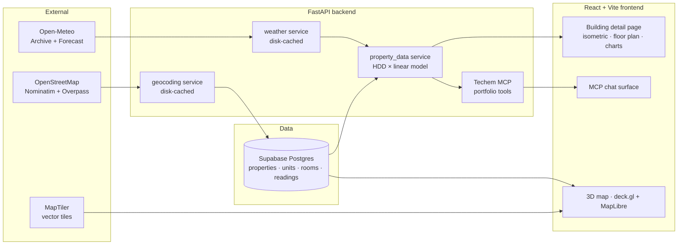
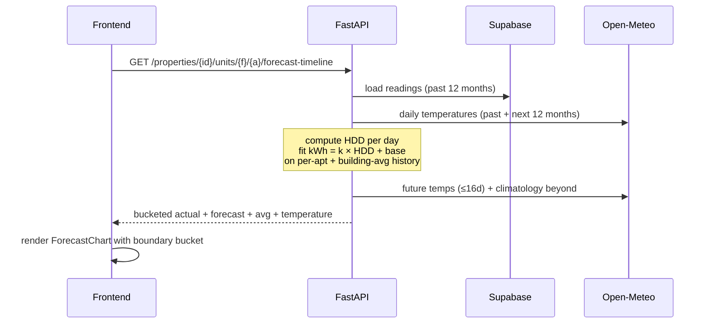

# Techem Energy Intelligence

A full-stack prototype for the Techem hackathon case: turn raw meter data into a living view of a real-estate portfolio — energy, cost, emissions, and a weather-driven forecast for every apartment.

Built as three loosely coupled surfaces:

- **Backend** — a FastAPI service that merges meter readings with live weather to produce KPIs, histories, and forecasts per apartment.
- **Frontend** — a React + Vite app with an interactive 3D portfolio map, isometric buildings, floor plans, and comparison charts.
- **Techem MCP** — a natural-language gateway over the portfolio: summaries, anomaly scans, and a full intelligence report.

## The idea

Techem sits on millions of building readings. We wanted to show what becomes possible when that data is stitched together with **public context** (weather, geometry, geography) and surfaced in a product that a portfolio manager actually wants to open in the morning.

Three design bets:

1. **Weather is the story.** Energy demand in residential buildings is dominated by outside temperature. So every history and every forecast is tied to real temperatures from [Open-Meteo](https://open-meteo.com/) via a Heating-Degree-Day (HDD) model.
2. **Gaps are not blockers.** When a property has no readings, we synthesize a plausible series from the same HDD model + deterministic per-unit variance. The UX never breaks.
3. **One source of truth, many views.** The backend owns all numbers. The frontend is a thin, beautiful lens. The MCP server is a third lens with the same data as backbone.

## High-level architecture



## Features at a glance

- **Portfolio map** — 20+ properties rendered on a 3D MapLibre map with OSM footprints, heat-colored extrusions, and click-to-fly detail.
- **Property list** — live KPI cards (annual kWh, €, CO₂) with color-coded performance relative to portfolio average.
- **Building detail** — an isometric building you can click per apartment, a 2D floor plan per unit, room-level pie charts, and multi-granularity comparison charts.
- **Weather-driven forecast** — per-apartment actual-vs-forecast timeline at monthly / weekly / daily resolution, overlaid with the building average and temperature curve.
- **Techem MCP surface** — natural-language chat with three built-in tools: portfolio summary, anomaly scan, and intelligence report.
- **Graceful fallbacks** — missing readings synthesize from weather; missing geometry falls back to centroid + default height; no API keys required for the default map style.

## Data and intelligence pipeline



Key ideas:

- **HDD × linear model.** Heating-Degree-Days (base 15 °C) are a well-known proxy for heating demand. We fit `kWh = k·HDD + base` by ordinary least squares on every apartment's own history, so k encodes the building envelope and occupancy pattern.
- **Open-Meteo window.** The free forecast goes 16 days out. Beyond that, we fall back to the same calendar day from last year as a climatological proxy — good enough for seasonality shape.
- **Disk-cached weather & geocoding.** Every temperature series and every `(zipcode, city) → (lat, lng)` lookup is cached in JSON on the backend so demos stay fast and the free APIs stay happy.
- **Two-pass synthesis.** If a property has zero readings, per-apartment series are generated from HDD × deterministic per-unit factors so totals stay consistent across the UI.

## Stack

| Layer         | Choice                                               |
| ------------- | ---------------------------------------------------- |
| Frontend      | React 19 · Vite · Tailwind · shadcn/ui · Recharts · deck.gl · MapLibre |
| Backend       | FastAPI · Pydantic · httpx                           |
| Database      | Supabase Postgres (properties, units, rooms, readings) |
| Weather       | Open-Meteo (archive + forecast)                      |
| Geocoding     | OpenStreetMap Nominatim                              |
| Basemap       | MapTiler (optional, Carto Positron as fallback)      |
| Deploy        | Railway (backend) · Vercel (frontend)                |

## Repository layout

```
backend/    FastAPI service, Supabase schema, migrations, seed scripts
frontend/   React app (portfolio map, building detail, MCP chat)
Dockerfile  Backend container entrypoint
```

Deep-dives per surface:

- [Backend README](backend/README.md) — data model, HDD model, weather pipeline, MCP tools
- [Frontend README](frontend/README.md) — pages, map, isometric building, charts
- [MCP server README](backend/app/mcp/README.md) — chat protocol, tools, routing

## Quick start

```bash
# backend
cd backend && python -m venv ../.venv
../.venv/bin/python -m pip install -r requirements.txt
../.venv/bin/uvicorn app.main:app --reload --port 8000

# frontend (in a second shell)
cd frontend && npm install && npm run dev
```

Then open `http://localhost:5173`.

For environment variables, Supabase schema bootstrap, and deployment, see [backend/README.md](backend/README.md) and [frontend/README.md](frontend/README.md).

## Design principles

- **Minimal, premium, high-contrast.** Black and white, with Techem red (`#E30613`) as the only accent.
- **Light corner rounding.** `rounded-md` everywhere — no pill buttons, no heavy cards.
- **Heroicons + Geist.** Self-hosted variable font, one icon system.
- **Data first, chrome second.** Every screen is built around one number that matters.
