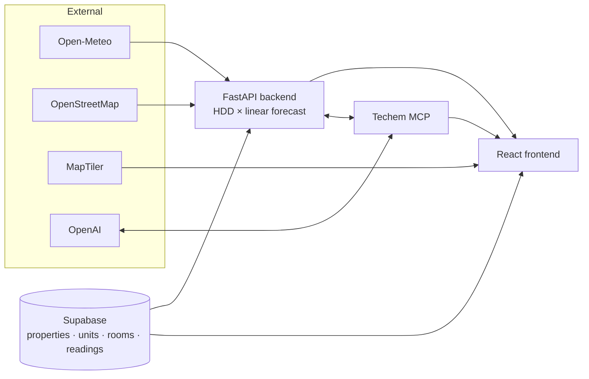

<div align="center">
  
</div>

# Techem Horizon

>  Portfolio-intelligence platform for real-estate energy data.


<br />

<br />

Raw meter readings get stitched together with live weather, geometry and geo data to produce a living view of every building and apartment — with interactive overviews
, forecasts **Techem MCP** as the AI chatbot on top.

Three surfaces:

- **Backend** — FastAPI service that owns all numbers (KPIs, histories, weather-driven forecasts).
- **Frontend** — React + Vite app: 3D map, isometric buildings, floor plans, charts.
- **Techem MCP** — natural-language chatbot powered by OpenAI function-calling over the backend's tools.

## The idea

Techem sits on millions of building readings. Horizon shows what happens when that data meets **public context** (Open-Meteo weather, OSM geometry, Nominatim geocoding) and lands in a product a portfolio manager actually wants to open.

Three bets:

1. **Weather is the story.** Residential demand follows outside temperature. Every forecast fits `kWh = k·HDD + base` on real Open-Meteo data.
2. **Gaps are not blockers.** Missing readings? Deterministic HDD-based synthesis keeps the UX consistent.
3. **One source of truth.** Backend owns numbers. Frontend is a lens. MCP is a second lens, asked in English.

## Architecture



## Features

- **Portfolio map** — 3D MapLibre with OSM footprints, heat-colored extrusions, click-to-fly.
- **KPI cards** — annual kWh, €, CO₂ per building, color-coded vs. portfolio average.
- **Building detail** — isometric building (click per apartment), 2D floor plan, room-level pie chart, comparison + forecast charts at monthly / weekly / daily.
- **Weather-driven forecast** — actual-vs-forecast timeline overlaid with building average and temperature.
- **Techem MCP chatbot** — OpenAI function-calling over live backend tools (portfolio stats, rankings, anomaly scans, full report).

## Repo

```
backend/    FastAPI + Supabase + Techem MCP
frontend/   React + Vite app
```

- [backend/](backend/README.md) — data model, HDD forecast, APIs
- [frontend/](frontend/README.md) — pages, map, charts
- [Techem MCP](backend/app/mcp/README.md) — OpenAI agent, tools, chat protocol

## Quick start

```bash
# backend
cd backend && python -m venv ../.venv
../.venv/bin/python -m pip install -r requirements.txt
../.venv/bin/uvicorn app.main:app --reload --port 8000

# frontend
cd frontend && npm install && npm run dev
```

Open `http://localhost:5173`. Env, schema bootstrap, and deployment live in the sub-READMEs.

## Stack

React 19 · Vite · Tailwind · shadcn/ui · Recharts · deck.gl · MapLibre · FastAPI · Pydantic · Supabase Postgres · Open-Meteo · Nominatim · OpenAI · Railway · Vercel.

## Scope

This project was created during the [Futury Build Days 2026](https://www.starthub-hessen.de/de/events/futury-build-days/).  
Challenge given by [Techem](https://www.techem.com/).
