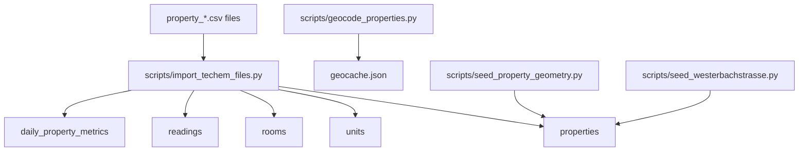
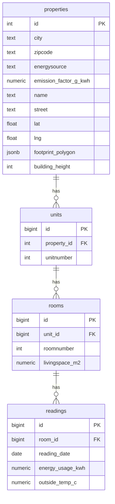
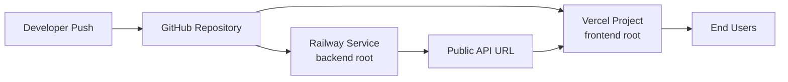

# Techem Hackathon Case

Full-stack prototype for energy and emissions analytics, property mapping, and baseline forecasting.

## Stack

- Frontend: React + TypeScript + Vite + Tailwind + Recharts + Deck.gl/MapLibre
- Backend: FastAPI (Python)
- Data: Supabase Postgres
- Backend deploy: Railway
- Frontend deploy: Vercel

## Architecture Diagram

```mermaid
flowchart LR
   User[User Browser]
   FE[Frontend<br/>React + Vite]
   API[FastAPI Backend]
   SB[(Supabase Postgres)]
   CSV[CSV Source Files]

   User --> FE
   FE -->|metrics + forecast| API
   FE -->|properties (direct query)| SB
   API -->|daily metrics + forecasting input| SB
   CSV -->|import script| SB
```

## Repository Layout

```text
.
├── backend/
│   ├── app/
│   │   ├── main.py
│   │   ├── config.py
│   │   ├── schemas.py
│   │   └── services/
│   │       ├── forecast.py
│   │       ├── geocoding.py
│   │       ├── mock_data.py
│   │       └── supabase_data.py
│   ├── migrations/
│   │   └── 001_add_property_geometry.sql
│   ├── scripts/
│   │   ├── geocode_properties.py
│   │   ├── import_techem_files.py
│   │   ├── seed_property_geometry.py
│   │   └── seed_westerbachstrasse.py
│   ├── sql/
│   │   └── schema.sql
│   ├── geocache.json
│   ├── requirements.txt
│   └── railway.toml
├── frontend/
│   ├── src/
│   │   ├── components/
│   │   ├── pages/
│   │   └── lib/
│   ├── package.json
│   ├── components.json
│   └── vercel.json
├── package.json
└── railway.toml
```

## Local Development

### 1) Backend

```bash
cd backend
python -m venv ../.venv
../.venv/bin/python -m pip install -r requirements.txt
../.venv/bin/uvicorn app.main:app --reload --host 0.0.0.0 --port 8000
```

Health check:

```bash
curl http://localhost:8000/health
```

### 2) Frontend

From the repo root:

```bash
npm install
npm run dev
```

Or directly in frontend:

```bash
cd frontend
npm install
npm run dev
```

Frontend runs on `http://localhost:5173` by default.

## Environment Variables

### Backend (`backend/.env`)

- `SUPABASE_URL`
- `SUPABASE_KEY`
- `SUPABASE_SERVICE_ROLE_KEY` (required for import/seed scripts)
- `SUPABASE_TABLE` (default: `daily_property_metrics`)
- `SUPABASE_SUMMARY_TABLE` (default: `daily_property_metrics`)
- `SUPABASE_TIME_COLUMN` (default: `reading_date`)
- `SUPABASE_ENERGY_COLUMN` (default: `total_energy_kwh`)
- `SUPABASE_EMISSION_COLUMN` (default: `total_emission_kg_co2e`)
- `FRONTEND_ORIGIN` (default: `http://localhost:5173`)
- `TECHEM_SOURCE_DIR` (optional, used by CSV import script)

### Frontend (`frontend/.env`)

- `VITE_API_BASE_URL` (for FastAPI endpoints, e.g. `http://localhost:8000`)
- `VITE_SUPABASE_URL` (required for direct Supabase property queries in UI)
- `VITE_SUPABASE_ANON_KEY` (required for direct Supabase property queries in UI)

## API Endpoints

- `GET /health`
- `GET /api/v1/properties`
- `GET /api/v1/metrics/overview`
- `GET /api/v1/forecast?horizon_days=30` (`7..365`)

## Database Setup

1. Run schema bootstrap SQL from `backend/sql/schema.sql`.
2. Apply geometry migration from `backend/migrations/001_add_property_geometry.sql`.

Without the geometry migration, the frontend falls back to loading properties without geometry columns.

## Data Import And Seeding





Import Techem CSV files:

```bash
cd backend
../.venv/bin/python scripts/import_techem_files.py
```

Pre-geocode and cache properties:

```bash
cd backend
../.venv/bin/python -m scripts.geocode_properties
```

Optional geometry seeding helpers:

```bash
cd backend
../.venv/bin/python scripts/seed_property_geometry.py
../.venv/bin/python scripts/seed_westerbachstrasse.py
```

## Deployment



### Backend (Railway)

1. Create a Railway service from this repository.
2. Set service root directory to `backend`.
3. Configure backend environment variables.
4. Deploy (uses `backend/railway.toml`).

### Frontend (Vercel)

1. Set project root directory to `frontend`.
2. Build command: `npm run build`.
3. Output directory: `dist`.
4. Configure env vars:
   - `VITE_API_BASE_URL`
   - `VITE_SUPABASE_URL`
   - `VITE_SUPABASE_ANON_KEY`
5. Redeploy.

## Notes

- Backend can fall back to mock metrics data when Supabase access is unavailable.
- Forecasting currently uses a baseline linear regression model.

