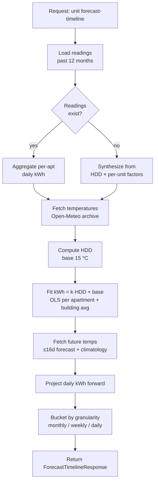
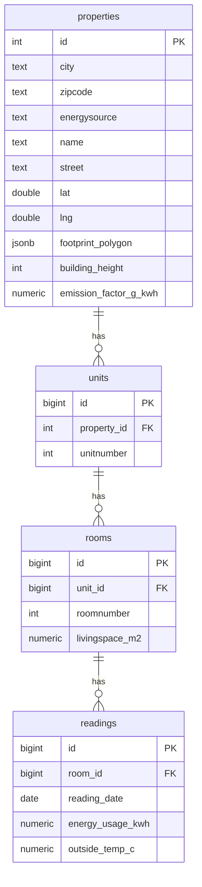

# Backend — Techem Energy API

FastAPI service that turns meter readings into KPIs, histories, and forecasts for every apartment in the portfolio. All math lives here; the frontend stays a thin lens.

## What it does

- Serves the **portfolio index** (properties with geometry, energy source, unit counts).
- Computes **annual KPIs** per property — kWh, €, kg CO₂ — using real readings when available and a weather-driven synthesis when not.
- Returns per-apartment **history** at monthly / weekly / daily granularity, each paired with the building-wide average.
- Returns a per-apartment **forecast timeline** blending actuals and a 12-month HDD × linear model fit, overlaid with temperature.
- Exposes the **Techem MCP** endpoint for natural-language portfolio queries.

## Pipeline overview



## Core ideas

### Heating-Degree-Days (HDD)

Residential energy demand in Germany is overwhelmingly driven by heating. HDD captures that with one number per day:

```
HDD(d) = max(0, 15 °C − mean_temp(d))
```

Fit `kWh = k·HDD + base` on the last 12 months of a single apartment and you get:

- **k** — the apartment's sensitivity to cold (building envelope + occupancy).
- **base** — baseline hot-water and standby load.

Same model is fit for the building-wide average so the forecast chart can draw both lines with the same physics.

### Weather sources

- **Historical** — Open-Meteo ERA5 archive (`temperature_2m_mean`, Europe/Berlin TZ).
- **Forecast** — Open-Meteo forecast API, capped at 16 days.
- **Beyond 16 days** — climatological proxy: same calendar day from last year.

All responses are cached to `backend/weathercache.json` keyed by rounded `(lat, lng)`, so demos don't hammer the shared free-tier pool.

### Synthesis fallback

If a property has no readings, `services.property_data._synthesize_reading` generates a daily kWh series from:

```
kWh ≈ HDD × heating_coef × unit_factor × room_factor × (sqm / ref_sqm)
     + base_load × unit_factor × room_factor
```

`unit_factor` and `room_factor` are deterministic hashes of the IDs — same input always produces the same number, so totals stay consistent across requests.

### Geocoding

`services.geocoding` hits OpenStreetMap Nominatim for `zipcode + city → (lat, lng)`, rate-limited to one request per 1.1 s and cached to `backend/geocache.json`. Only used when a property row is missing coordinates.

## Data model

Four tables, one per grain:



Schema lives in [`sql/schema.sql`](sql/schema.sql). Geometry columns are added by [`migrations/001_add_property_geometry.sql`](migrations/001_add_property_geometry.sql).

## Services

| Module                          | Purpose                                                         |
| ------------------------------- | --------------------------------------------------------------- |
| `services/property_data.py`     | Stats, building overview, history, forecast, timeline bucketing |
| `services/weather.py`           | Open-Meteo archive + forecast + climatology, disk-cached        |
| `services/forecast.py`          | Legacy linear-trend baseline (used by `/api/v1/forecast`)       |
| `services/geocoding.py`         | Nominatim lookup with rate-limit + disk cache                   |
| `services/supabase_data.py`     | Typed loaders for `properties` and aggregated metrics           |
| `services/mock_data.py`         | Offline fallback for the overview endpoint                      |
| `mcp/`                          | Natural-language portfolio chat (see [mcp/README.md](app/mcp/README.md)) |

## API surface

| Method | Path                                                                  | Purpose                               |
| ------ | --------------------------------------------------------------------- | ------------------------------------- |
| GET    | `/health`                                                             | Health probe                          |
| GET    | `/api/v1/properties`                                                  | Portfolio index with geometry         |
| GET    | `/api/v1/properties/stats`                                            | Annual KPIs for all properties        |
| GET    | `/api/v1/properties/{id}/stats`                                       | Annual KPIs for one property          |
| GET    | `/api/v1/properties/{id}/overview`                                    | All units + rooms for one property    |
| GET    | `/api/v1/properties/{id}/units/{floor}/{apt}/history`                 | Monthly/weekly/daily unit history     |
| GET    | `/api/v1/properties/{id}/units/{floor}/{apt}/forecast`                | 12-month monthly forecast             |
| GET    | `/api/v1/properties/{id}/units/{floor}/{apt}/forecast-timeline`       | Actual + forecast bucketed            |
| GET    | `/api/v1/metrics/overview`                                            | Aggregated daily metrics              |
| GET    | `/api/v1/forecast`                                                    | Portfolio-wide baseline forecast      |
| POST   | `/api/v1/mcp/chat`                                                    | Techem MCP chat                       |

## Local setup

```bash
cd backend
python -m venv ../.venv
../.venv/bin/python -m pip install -r requirements.txt
../.venv/bin/uvicorn app.main:app --reload --host 0.0.0.0 --port 8000
```

Bootstrap the database:

```bash
# 1. Apply schema in Supabase SQL editor
#    → sql/schema.sql
#    → migrations/001_add_property_geometry.sql

# 2. Import CSVs
../.venv/bin/python scripts/import_techem_files.py

# 3. Seed geometry (names, coords, footprints, heights)
../.venv/bin/python -m scripts.seed_property_geometry
```

## Environment

```
SUPABASE_URL=
SUPABASE_KEY=                     # anon key — read path
SUPABASE_SERVICE_ROLE_KEY=        # only needed for CSV import / seeding
FRONTEND_ORIGIN=http://localhost:5173
```

If no valid Supabase config is present, the overview endpoint falls back to mock data so the app still boots.

## Design notes

- **`ASSUMED_TODAY` is fixed** to 2024-10-15 in `app/config.py` so the demo always has winter in its forecast window, regardless of wall-clock time.
- **Stats are cached** at the module level (`get_all_property_stats`). First request fans out with a `ThreadPoolExecutor`; subsequent requests are instant.
- **CORS** allows `FRONTEND_ORIGIN` + any `*.vercel.app` host by regex.
- **No ML dependency**. OLS and HDD are all that's needed for the forecast quality bar we're shooting for.
