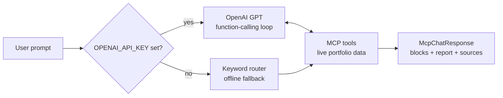

# Techem MCP

The AI chatbot inside Techem Horizon. Ask the portfolio in English, get structured answers the frontend renders as stats, lists, cards, or a full sidebar report.

See the [main README](../../../README.md) for product context.

## How it works

Two modes, one endpoint:



- **LLM mode (default when key is set).** GPT reasons over the tools, calls as many as it needs (up to 5 iterations), composes the final answer. Provenance is tracked per tool call.
- **Keyword fallback.** Deterministic routing to one of three canonical tools. Used when no key is configured so the demo still works offline.

## Tools (OpenAI function schemas)

| Tool                         | Purpose                                                    |
| ---------------------------- | ---------------------------------------------------------- |
| `list_properties`            | Portfolio index with filters (city, energy source, limit)  |
| `get_property_detail`        | Single property with geometry + annual stats               |
| `portfolio_stats`            | Aggregated KPIs + energy-mix breakdown                     |
| `rank_properties`            | Top/bottom N by energy, cost, CO₂, per-unit or absolute    |
| `anomaly_scan`               | z-score scan on kWh/unit; flags outliers                   |
| `get_forecast`               | 12-month HDD-based forecast for a property                 |
| `generate_portfolio_report`  | Full `McpReport` rendered in the sidebar                   |
| `get_today`                  | Returns `ASSUMED_TODAY` so GPT reasons on the right date   |

All tools return plain JSON-serializable dicts and read from the same services that back the REST API.

## Response shape

```
McpChatResponse {
  blocks:  [paragraph | list | stats | note]   # inline chat answer
  report:  McpReport | null                    # optional sidebar panel
  sources: string[]                            # provenance (e.g. "Supabase · properties")
  stages:  string[]                            # "thinking" labels for the UI
}
```

Full Pydantic models in [`schemas.py`](schemas.py).

## API

```
POST /api/v1/mcp/chat
{ "prompt": "Which three buildings should I retrofit first?" }
```

## Files

| File            | Purpose                                      |
| --------------- | -------------------------------------------- |
| `service.py`    | Entry point, LLM vs. keyword mode switch     |
| `llm.py`        | OpenAI agent loop (tool-calling, ≤5 iters)   |
| `llm_tools.py`  | Tool implementations + OpenAI schemas        |
| `tools.py`      | Keyword-mode tool payloads                   |
| `schemas.py`    | Pydantic models                              |

## Configuration

```
OPENAI_API_KEY=
OPENAI_MODEL=gpt-4o-mini   # default
```

Key is loaded lazily — the `openai` SDK is only imported when a prompt actually needs it.
