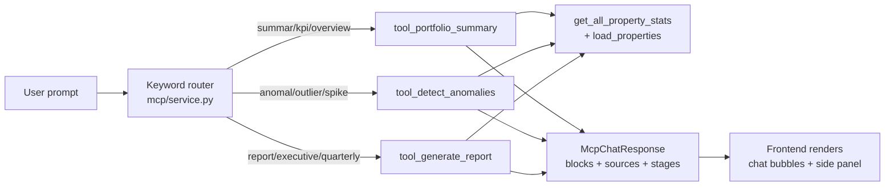

# Techem MCP — natural-language portfolio access

A small, focused server-side module that turns portfolio questions into structured answers the frontend can render as stats, lists, cards, or a full sidebar report.

## Why

The numbers the backend already computes — annual kWh, € cost, CO₂, building averages, per-property efficiency — are exactly the numbers a portfolio manager asks about in English:

> Summarize my portfolio. Which buildings are outliers? Generate the quarterly report.

The MCP endpoint packages those answers so the UI doesn't have to glue them together itself.

## Pipeline



## Tools

| Tool                  | Trigger keywords                           | Output                                                                 |
| --------------------- | ------------------------------------------ | ---------------------------------------------------------------------- |
| `portfolio_summary`   | *summar, overview, portfolio, performance, kpi*   | Paragraph + stat grid (kWh, €, CO₂, count) + top-3 consumers list     |
| `detect_anomalies`    | *anomal, unusual, outlier, detect, spike, flag*   | z-score scan on kWh/unit — lists high and low outliers (|z| > 1)      |
| `generate_report`     | *report, generate, quarterly, executive, intelligence* | Full `McpReport`: exec summary, headline stats, energy mix, efficiency leaders, retrofit cards, recommendations |

Routing is deliberately **deterministic keyword-based** so the demo is reliable offline and the three canonical prompts always behave identically. Free-form prompts fall back to the portfolio summary — the safe default.

## Response shape

Every response is an `McpChatResponse` with four layers:

- `blocks` — the inline chat answer. Each block is a `paragraph`, `list`, `stats`, or `note`.
- `report` — optional `McpReport` with sections for the sidebar panel (`generate_report` only).
- `sources` — provenance strings shown under the answer (`Supabase · properties`, `Open-Meteo weather`, etc.).
- `stages` — short strings the UI plays back as "thinking" steps while the request runs.

Full schemas in [`schemas.py`](schemas.py).

## API

```
POST /api/v1/mcp/chat
{
  "prompt": "Generate the quarterly portfolio report"
}
```

Returns an `McpChatResponse`. The frontend's `McpPage` + `McpSidebar` render it directly.

## Why not an LLM here

We intentionally keep the routing layer pattern-based:

- **Speed** — no external call, sub-100ms responses.
- **Cost** — no per-request API spend during demos.
- **Reliability** — the same prompt always hits the same tool. No temperature drift during a live pitch.

The tools themselves pull from `get_all_property_stats` and `load_properties`, so when the underlying data gets richer, the answers get richer automatically. Wiring in a real LLM router on top later is straightforward — the tool boundary already matches the MCP tool-calling contract.

## Files

| File          | Purpose                                           |
| ------------- | ------------------------------------------------- |
| `service.py`  | Prompt → tool routing                             |
| `tools.py`    | The three tools, each a pure function over portfolio data |
| `schemas.py`  | Pydantic models for request, response, report     |

## See also

- [Backend README](../../README.md) — data model, forecast pipeline
- [Main README](../../../README.md) — full project overview
